# 냥냥스타 - 기업협약프로젝트 최종 버전

**냥냥스타**는 고양이와 교감하며 아이템을 모으고, 사진 촬영, 수조 꾸미기, 이벤트 미니게임, SNS형 콘텐츠를 통해 진행 상황을 저장하는 **Android 전용 모바일 캐주얼 게임 프로젝트**이다.

플레이어는 게스트 로그인 후 메인 화면에서 머지보드, 냥냥스냅, 냥쿠아리움, 냥스타그램, 뭉치를 찾아라, 스크래칭 타임, 임시보호 수첩으로 이동할 수 있다. 프로젝트는 Unity UI 기반의 9:16 세로 화면을 기준으로 제작했으며, Firebase Auth, Firestore, Firebase Storage, Addressables, Google Sheets 기반 데이터를 함께 사용한다.

이 README는 최종 개발 버전의 구현 범위와 실행 방법, 시스템 구조, 주요 검증 포인트를 한 번에 확인할 수 있도록 정리했다.

<!-- 게임 플레이 GIF 추가 위치: Images/Gameplay.gif -->

---

## 최종 업데이트 요약

| 영역 | 최종 버전 내용 |
| --- | --- |
| 빌드 방향 | Demo/CBT 검증 흐름에서 Android 최종 플레이 흐름 확인용 버전으로 정리했다. |
| 로그인 / 세션 | Firebase 익명 로그인, Firestore 초기화 대기, 로그인 진행률 표시, 로그아웃 및 유저 전환 시 런타임 데이터 초기화 흐름을 구성했다. |
| 메인 화면 | 주요 콘텐츠 진입 버튼, 공용 자원 표시, 설정/볼륨 팝업, 화면 전환, Safe Area 대응, 중복 입력 방지 흐름을 정리했다. |
| 머지보드 | 아이템 생성, 보드 슬롯 이동/스왑, 보상 큐, 특수 아이템 슬롯, 효과음, Firestore 저장/로드 흐름을 구현했다. |
| 냥쿠아리움 | 수조 화면, 물고기 배치/삭제, 자연 요소 배치, 수조 레벨/경험치, 퀘스트, 도감, 스토리 연동 흐름을 추가했다. |
| 냥냥스냅 | 스테이지 선택, 장난감/간식 배치, 촬영, 채점, 별점, 보석 보상, 광고 보상 버튼, 결과 저장 흐름을 구현했다. |
| 사진 저장 / 도감 | Firebase Storage 사진 업로드/다운로드/삭제, Firestore 사진 메타데이터 저장, 임시보호 수첩 목록/상세/필터 UI를 구성했다. |
| 냥스타그램 | 저장 사진 기반 게시물 등록, 홈/프로필, 게시물 상세, 알림, DM, NPC 프로필 UI 흐름을 구성했다. |
| 뭉치를 찾아라 | 이벤트 기간, 주차, 타일 탐색, 도구, 일일/주간 미션, 상점, 탐색 기회 도움말, 반응형 레이아웃을 구현했다. |
| 스크래칭 타임 | 일일/주간 스테이지, 터치 기반 진행, 결과 팝업, 보상 및 진행 상태 갱신 흐름을 구현했다. |
| 데이터 / 리소스 | Google Sheets 데이터를 ScriptableObject로 캐싱하고 Addressables 키 기반으로 Sprite, Audio, Prefab을 로드한다. |
| 안정화 | 팝업 뒤로가기, 닫기 동작, Firebase 준비 상태, 저장 데이터 정규화, UI 프리팹 연결, 버튼 클릭 효과음, 화면 레이아웃 이슈를 보완했다. |

---

## 프로젝트 정보

| 항목 | 내용 |
| --- | --- |
| 프로젝트명 | 냥냥스타 |
| 개발 기간 | 2026.05.26 ~ 2026.07.13 |
| 프로젝트 형태 | 기업협약 팀 프로젝트 최종 개발 버전 |
| 팀 구성 | 기획 9명 / 개발 5명 |
| 장르 | 모바일 캐주얼 / 수집 / 미니게임 |
| 타겟 플랫폼 | Android |
| 화면 방향 | 세로 UI 기준 |
| 기준 해상도 | 1080 x 1920 |
| Unity Product Name | NyangNyangStar |
| Application ID | com.CompnayColoabo_2Team.NyangNyangStar |
| Android SDK | Min SDK 29 / Target SDK 34 |

---

## 개발 환경

| 분류 | 사용 기술 |
| --- | --- |
| Engine | Unity 2022.3.62f2 |
| Language | C# |
| UI | Unity UI, TextMeshPro, Safe Area 대응 |
| Resource | Addressables 1.22.3 |
| Backend | Firebase Auth, Firestore, Firebase Storage |
| Data | Google Sheets, ScriptableObject |
| Advertisement | Unity Ads 4.17.0 |
| Animation | DOTween |
| Rendering | Universal Render Pipeline 14.0.12 |
| Audio | Addressables 기반 BGM / SFX |
| Collaboration | GitHub |
| Tool | Rider, Visual Studio, GitHub Desktop, Figma, Notion, Codex |

---

## 주요 기능

- Firebase 익명 로그인과 유저별 진행 데이터 저장
- 메인 화면 기반 모바일 콘텐츠 허브
- 에너지, 코인, 보석을 관리하는 공용 자원 시스템
- 머지보드 아이템 생성, 슬롯 이동, 보상 큐, 특수 아이템 슬롯
- 냥쿠아리움 수조 꾸미기, 물고기 배치, 도감, 퀘스트, 스토리
- 냥냥스냅 스테이지 선택, 촬영, 채점, 별점 보상
- Firebase Storage 기반 사진 저장과 임시보호 수첩
- 저장 사진을 활용하는 냥스타그램 게시물, 알림, DM, NPC 프로필
- 뭉치를 찾아라 이벤트 탐색, 미션, 상점, 도구 사용
- 스크래칭 타임 일일/주간 스테이지와 결과 보상
- Google Sheets 데이터 파싱과 ScriptableObject 캐싱
- Addressables 기반 Sprite, Audio, Prefab 로드
- 팝업 스택, 뒤로가기, 화면 전환, 중복 입력 방지

---

## 조작 및 플레이 방식

| 입력 | 기능 |
| --- | --- |
| 터치 / 클릭 | 버튼 선택, 팝업 열기/닫기, 콘텐츠 진행 |
| 드래그 | 머지보드 아이템 이동, 일부 배치형 UI 조작 |
| 촬영 버튼 | 냥냥스냅 사진 촬영 및 결과 계산 |
| 콘텐츠별 확인 / 보상 버튼 | 진행 저장, 보상 수령, 결과 화면 이동 |
| 뒤로가기 / 닫기 버튼 | 팝업 종료, 이전 화면 복귀 |

---

## 프로젝트 구조

```text
2Team_NyangNyangStar
├── README.md
├── Images
│   ├── LoginScreen.png
│   ├── MainScreen.png
│   ├── MergeBoard.png
│   ├── ItemGenerate.png
│   ├── NyangNyangSnapStage.png
│   ├── TakePicture.png
│   ├── SnapResult.png
│   └── ScratchingTime.png
└── NyangNyangStar
    ├── Assets
    │   ├── AddressableAssetsData
    │   ├── Arts
    │   ├── Audio
    │   ├── Data
    │   ├── Firebase
    │   ├── Prefabs
    │   ├── Resources
    │   ├── Scenes
    │   │   ├── Login Scene.unity
    │   │   └── Game Scene.unity
    │   ├── Scripts
    │   │   ├── Addressable
    │   │   ├── Audio
    │   │   ├── Core
    │   │   ├── Data
    │   │   ├── FireStore
    │   │   ├── Services
    │   │   └── UI
    │   └── TextMesh Pro
    ├── Packages
    └── ProjectSettings
```

---

## 구현 범위

| 구분 | 구현 여부 | 설명 |
| --- | --- | --- |
| 로그인 / 게스트 로그인 | 구현 | Firebase 익명 로그인, 세션 초기화, 로그인 진행률, 유저 전환 시 데이터 초기화 흐름을 구성했다. |
| 메인 화면 | 구현 | 콘텐츠 진입 버튼, 공용 자원 UI, 설정/볼륨 팝업, 화면 전환, 로그아웃 흐름을 배치했다. |
| 공용 자원 시스템 | 구현 | 에너지, 코인, 보석을 Firestore와 동기화하고 콘텐츠별 지급/소모에 사용한다. |
| 머지보드 시스템 | 구현 | 아이템 확인, 선택, 이동, 스왑, 보상 큐, 특수 슬롯, 서버 저장/로드 흐름을 구현했다. |
| 아이템 생성 시스템 | 구현 | 에너지를 소모해 아이템을 생성하고, 보상 큐 또는 보드에 반영한다. |
| 냥쿠아리움 | 구현 | 수조 진입, 물고기/자연 요소 배치, 레벨/경험치, 퀘스트, 도감, 저장/로드 흐름을 구현했다. |
| 스토리 UI | 구현 | 퀘스트 진행에 따라 스토리 대사를 노출하고, 읽은 스토리 상태를 저장하는 흐름을 구성했다. |
| 냥냥스냅 촬영 시스템 | 구현 | 스테이지 선택, 장난감/간식 배치, 촬영, 결과 화면, 재시도 흐름을 구현했다. |
| 촬영 채점 시스템 | 구현 | 촬영 결과를 점수, 별점, 보석 보상으로 환산하는 구조를 구현했다. |
| 사진 저장 시스템 | 구현 | 촬영 결과 이미지를 Firebase Storage에 저장하고 Firestore에 메타데이터를 저장한다. |
| 임시보호 수첩 / 사진 도감 | 구현 | 저장 사진 목록, 상세 보기, 삭제, 별점 필터, 새 사진 알림 흐름을 구현했다. |
| 냥스타그램 | 구현 | 저장 사진 기반 게시물 등록, 홈/프로필, 알림, DM, NPC 프로필 UI를 구성했다. |
| 뭉치를 찾아라 | 구현 | 이벤트 기간, 주차, 타일 탐색, 도구 사용, 미션, 상점, 진행 저장/로드를 구현했다. |
| 스크래칭 타임 | 구현 | 일일/주간 스테이지 선택, 터치 기반 진행, 결과 보상, 진행 상태 갱신 흐름을 구현했다. |
| Addressables 리소스 로드 | 구현 | Sprite, Audio, Prefab 로드 구조와 그룹/라벨 키 관리 구조를 구현했다. |
| Firestore 저장 / 로드 | 구현 | 플레이어 기본 정보, 자원, 콘텐츠 진행 상황, 사진 메타데이터 저장/로드를 구현했다. |
| Firebase Storage | 구현 | 유저별 사진 업로드, 다운로드, 삭제 헬퍼와 UI 연동을 구현했다. |
| Unity Ads | 구현 | 냥냥스냅 결과 보상형 광고 버튼과 광고 초기화 흐름을 구현했다. |
| Audio 시스템 | 구현 | BGM, SFX 재생과 주요 버튼 클릭 효과음을 구성했다. |
| UI 팝업 시스템 | 구현 | 팝업 UI를 스택 기반으로 관리하고 주요 팝업의 열기/닫기 흐름을 정리했다. |

---

## 구현한 시스템

### 로그인 및 데이터 로드

로그인 화면에서 게스트 로그인을 진행하고, 로그인 이후 플레이어 기본 정보와 콘텐츠 진행 상황을 불러온다.

Firebase 준비 상태, Auth 로그인, Firestore 초기화, 저장 데이터 로드 순서를 분리했으며, 유저가 바뀌거나 로그아웃하는 경우 사진 런타임 데이터와 콘텐츠 진행 데이터를 정리한다.

### 메인 화면

메인 화면은 각 콘텐츠로 진입하는 허브 역할을 한다.

최종 버전에서는 머지보드, 냥쿠아리움, 냥냥스냅, 스크래칭 타임, 뭉치를 찾아라, 임시보호 수첩, 냥스타그램으로 진입할 수 있다. 설정, 볼륨, 화면 전환, 공용 자원 표시, Safe Area 보정도 함께 처리한다.

### 공용 자원 시스템

공용 자원 시스템은 에너지, 코인, 보석을 하나의 관리 흐름으로 묶는다.

콘텐츠에서 자원을 소모하거나 지급하면 Firestore와 UI 표시가 함께 갱신되며, 머지보드 아이템 생성, 냥냥스냅 보상, 뭉치를 찾아라 보상, 냥쿠아리움 진행 흐름에 사용된다.

### 머지보드 시스템

머지보드는 아이템을 확인하고, 선택하고, 빈 슬롯으로 이동하거나 다른 아이템과 스왑할 수 있는 보드 시스템이다.

에너지를 소모해 아이템을 생성하고, 일반 아이템은 보드 또는 보상 큐로 이동한다. 보드가 가득 찬 경우 보상 큐에 보관했다가 빈 공간이 생기면 다시 지급할 수 있다. 특수 아이템은 별도 슬롯에 저장하며, 버튼 클릭 효과음과 레이아웃 갱신 흐름도 함께 반영했다.

### 냥쿠아리움

냥쿠아리움은 수조를 꾸미고 물고기를 배치하며 퀘스트를 진행하는 성장형 콘텐츠이다.

수조 경험치와 레벨, 물고기/자연 요소 배치 정보, 도감 해금 상태, 퀘스트 진행 상태를 Firestore에 저장한다. 물고기 Sprite는 Addressables 키를 기준으로 캐싱하고, 퀘스트 보상과 스토리 UI를 통해 진행 흐름을 연결했다.

### 스토리 UI

스토리 UI는 퀘스트 진행 단계에 따라 대사 카드를 노출하는 팝업형 콘텐츠이다.

읽은 스토리 ID를 저장해 같은 스토리가 반복 노출되지 않도록 처리하고, 특정 퀘스트 완료 후 다음 스토리 또는 튜토리얼 흐름으로 이어지도록 구성했다.

### 냥냥스냅 촬영 시스템

냥냥스냅은 스테이지를 선택한 뒤 장난감과 간식을 배치해 고양이를 촬영하는 콘텐츠이다.

플레이어는 촬영 화면에서 고양이의 상태와 타이밍을 확인하고 촬영을 진행한다. 촬영 결과는 점수와 별점으로 환산되며, 결과 화면에서 저장, 재시도, 보상 수령 흐름으로 이어진다.

### 촬영 채점 및 보상 시스템

촬영 채점은 피사체 판정, 타이밍, 구도, 포즈, 배경, 오브젝트 요소를 기준으로 점수를 계산하는 구조이다.

최종 점수는 별점으로 환산되며, 별점에 따라 보석 보상을 지급한다. 결과 화면에서는 별점 연출과 보상형 광고 버튼을 함께 제공한다.

### 사진 저장 및 임시보호 수첩

촬영 결과 사진은 Firebase Storage에 저장하고, 사진 ID, 저장 경로, 별점, 생성 시간 등 메타데이터는 Firestore에 저장한다.

임시보호 수첩에서는 저장된 사진을 다시 불러와 목록으로 보여주고, 별점 필터, 상세 보기, 삭제, 새 사진 알림 흐름을 제공한다.

### 냥스타그램

냥스타그램은 저장된 냥냥스냅 사진을 기반으로 게시물을 등록하고 확인하는 SNS형 콘텐츠이다.

홈/프로필 전환, 앨범에서 게시물 사진 선택, 게시물 상세 보기, 알림, DM 리스트와 대화, NPC 프로필 화면을 팝업 흐름으로 구성했다.

### 뭉치를 찾아라

뭉치를 찾아라는 정해진 이벤트 기간 동안 타일을 탐색해 목표물을 찾는 이벤트 콘텐츠이다.

이벤트 일정, 현재 주차, 탐색 기회, 이벤트 코인, 일일/주간 미션, 이벤트 상점, 도구 사용, 도움말 팝업, 보상 지급, Firestore 진행 저장/로드를 포함한다. 머지보드에서 에너지를 소모하면 관련 미션 진행도와 탐색 기회 보너스도 갱신된다.

### 스크래칭 타임

스크래칭 타임은 터치 입력을 기반으로 진행되는 미니게임 콘텐츠이다.

일일/주간 스테이지를 선택하고 제한 조건 안에서 콘텐츠를 진행한다. 결과에 따라 보상과 진행 상태를 갱신하며, 결과 팝업과 스테이지 UI를 통해 플레이 흐름을 정리했다.

### 리소스 로드

Addressables를 사용하여 Sprite, Audio, Prefab을 로드한다.

Google Sheets에서 관리한 데이터는 ScriptableObject에 캐싱하고, 캐싱된 키 값을 기준으로 Addressables 리소스를 불러오는 구조이다. 주요 UI 프리팹과 콘텐츠 Sprite는 KeyContainer와 Addressables 그룹을 통해 관리한다.

### 데이터 저장 및 로드

Firestore를 사용하여 플레이어 기본 정보, 자원, 머지보드 슬롯, 보상 큐, 콘텐츠 진행 상황, 사진 메타데이터를 저장하고 불러온다.

사진 원본 이미지는 Firebase Storage에 저장하며, 게임 흐름은 로그인 이후 데이터 로드, 메인 화면 진입, 콘텐츠 진행, 결과 저장 순서로 구성했다.

---

## 전체 흐름

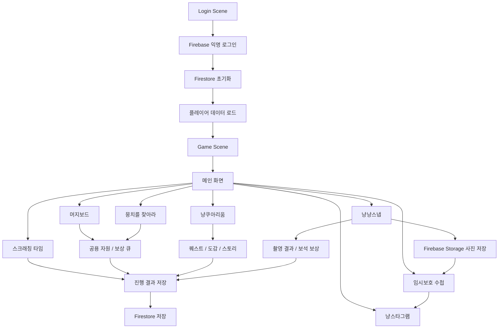

---

## 시스템 구조

```mermaid
flowchart TB
    GM[GameManager]

    GM --> UI[UIManager]
    GM --> AM[AddressableManager]
    GM --> DM[DataManager]
    GM --> AU[AudioManager]
    GM --> FS[FireStoreManager]
    GM --> SM[GameSceneManager]

    UI --> UIRoot[UI Root]
    UI --> SceneUI[Scene UI]
    UI --> PopupUI[Popup UI Stack]

    AM --> Prefab[Prefab Load]
    AM --> Sprite[Sprite Load]
    AM --> Audio[AudioClip Load]

    DM --> Sheet[Google Sheets]
    DM --> SO[ScriptableObject Cache]

    FS --> Auth[Firebase Auth]
    FS --> Player[Player Data]
    FS --> Progress[Content Progress]
    FS --> PhotoMeta[Photo Metadata]

    GM --> RM[PlayerResourceManager]
    RM --> ResourceUI[Resource Display]
    RM --> ResourceStore[ResourcesSO / Firestore]

    UI --> Main[Main UI]
    UI --> Board[머지보드]
    UI --> Aqua[냥쿠아리움]
    UI --> Snap[냥냥스냅]
    UI --> Find[뭉치를 찾아라]
    UI --> Scratch[스크래칭 타임]
    UI --> Book[임시보호 수첩]
    UI --> Gram[냥스타그램]
    UI --> Story[스토리 UI]

    Snap --> Storage[Firebase Storage]
    Snap --> Ads[Unity Ads]
    Aqua --> Quest[퀘스트 / 도감]
    Story --> Quest

    SM --> Login[Login Scene]
    SM --> Game[Game Scene]
```

---

## 데이터 흐름

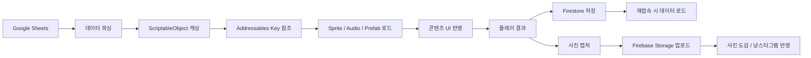

---

## 실행 방법

1. Unity Hub에서 `NyangNyangStar` 폴더를 Unity `2022.3.62f2` 버전으로 연다.
2. `Assets/Scenes/Login Scene.unity`와 `Assets/Scenes/Game Scene.unity`가 Build Settings에 등록되어 있는지 확인한다.
3. `Assets/google-services.json`과 Firebase 콘솔 설정이 현재 프로젝트와 맞는지 확인한다.
4. Addressables 그룹과 Google Sheets 기반 ScriptableObject 데이터가 최신 상태인지 확인한다.
5. `Login Scene`을 열고 Play 버튼을 눌러 게스트 로그인부터 테스트한다.

---

## 빌드 방법

1. Unity에서 `File > Build Settings`를 연다.
2. Platform을 `Android`로 전환한다.
3. `Scenes In Build`에 다음 씬이 순서대로 포함되어 있는지 확인한다.
   - `Assets/Scenes/Login Scene.unity`
   - `Assets/Scenes/Game Scene.unity`
4. Android Min SDK와 Target SDK 설정을 확인한다.
5. Firebase, Addressables, Unity Ads 설정이 빌드 환경에 맞는지 확인한다.
6. `Build` 또는 `Build And Run`으로 APK를 생성한다.

---

## 모바일 UI 구성

본 프로젝트는 **1080 x 1920 세로 해상도**를 기준으로 제작했다.

화면 중앙에는 콘텐츠 진행 영역을 배치하고, 주요 버튼은 화면 외곽에 배치하여 모바일 화면에서 콘텐츠 영역이 가려지지 않도록 구성했다.

최종 버전에서는 메인 화면에서 여러 콘텐츠 팝업, 보드 화면, 수조 화면, 촬영 화면을 오가므로 주요 팝업의 닫기 버튼, 뒤로가기 버튼, 배경 닫기, 중복 입력 방지, Safe Area 보정 처리를 함께 정리했다.

---

## 화면 미리보기

| 로그인 화면 | 메인 화면 | 머지보드 |
| --- | --- | --- |
| 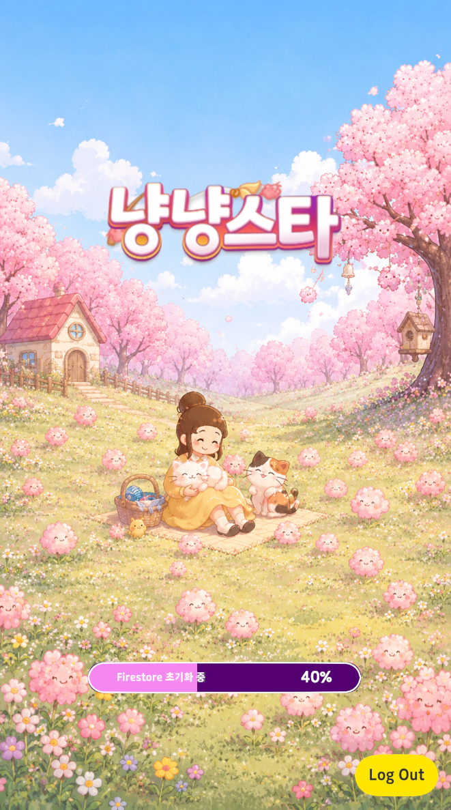 | 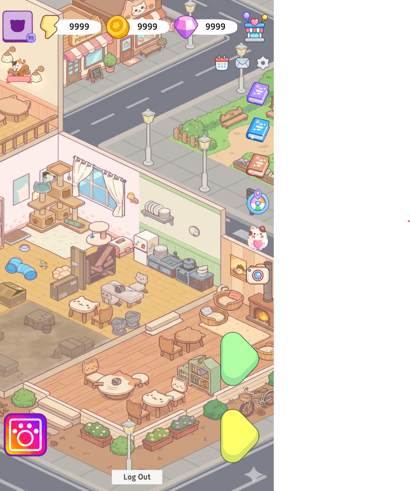 | 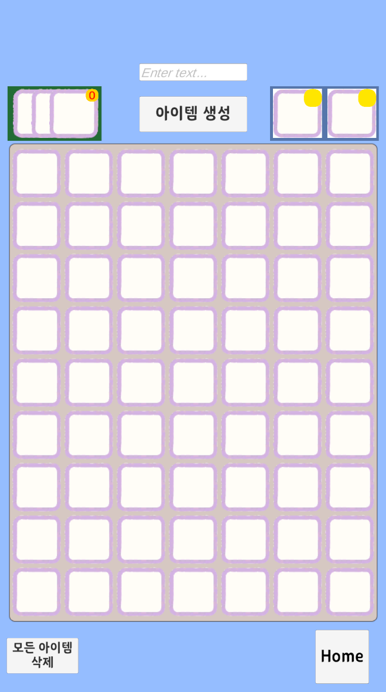 |

| 아이템 생성 | 냥냥스냅 스테이지 | 촬영 화면 |
| --- | --- | --- |
| 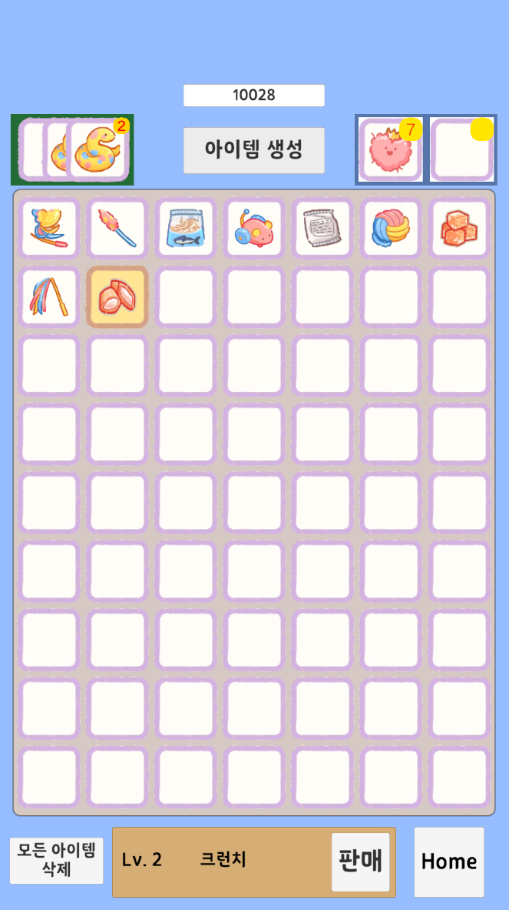 | 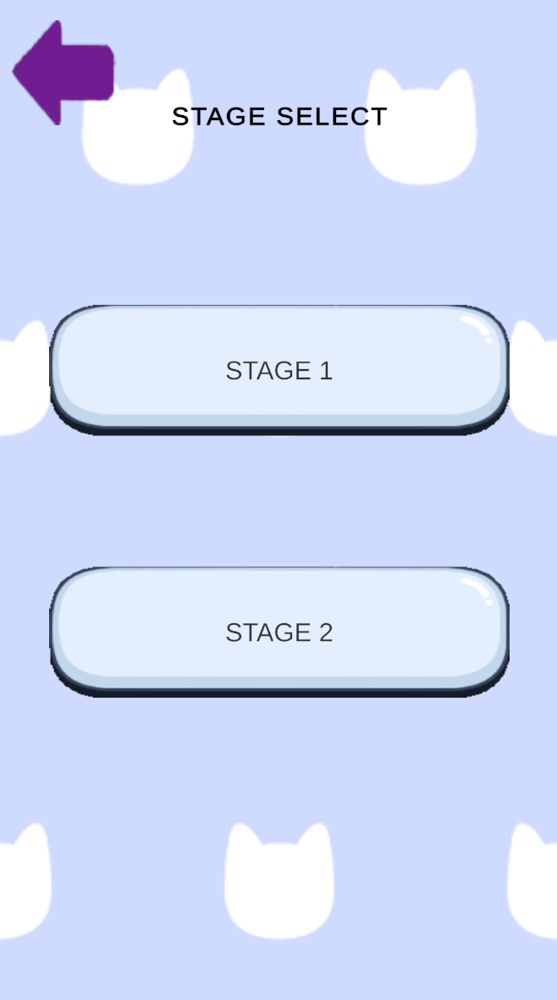 | 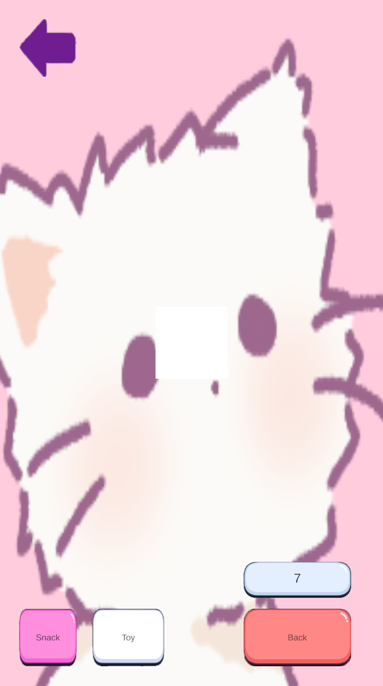 |

| 촬영 결과 | 스크래칭 타임 |
| --- | --- |
| 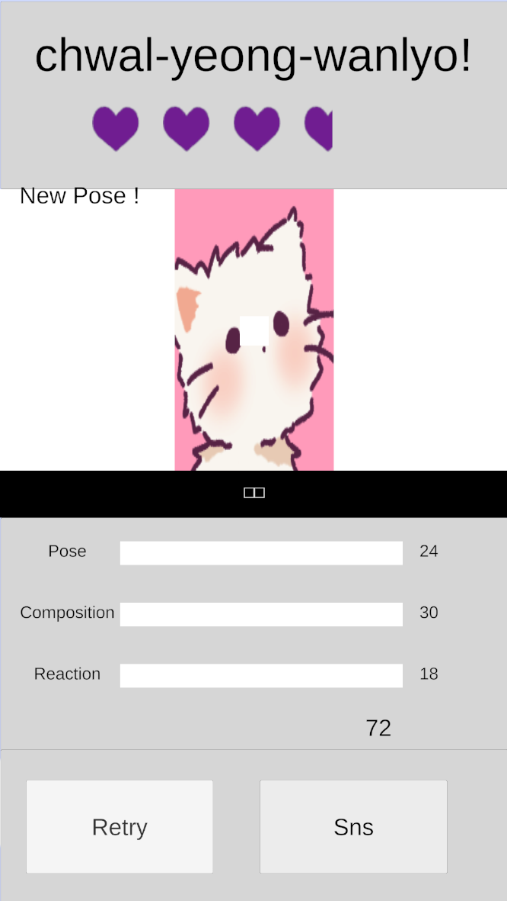 | 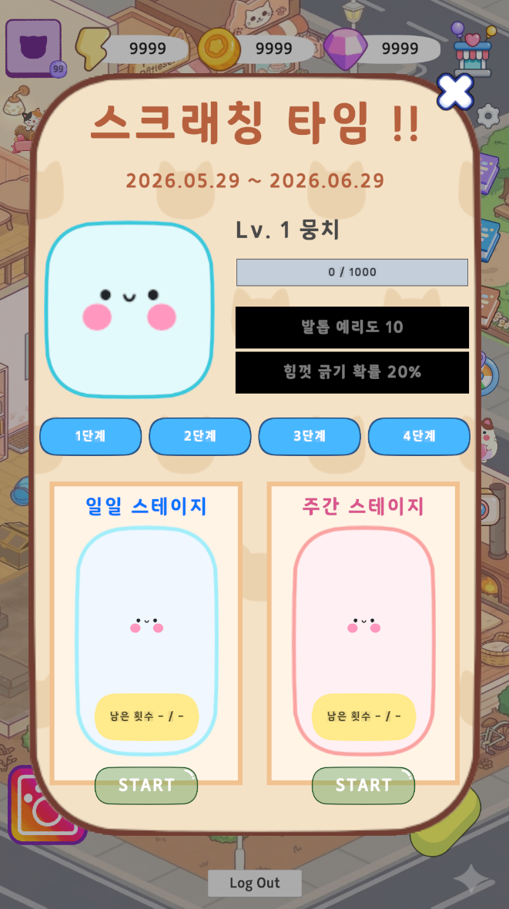 |

---

## AI 활용 방식

이 프로젝트에서는 Codex를 다음 작업에 활용했다.

- 구현 전 요구사항과 작업 범위 정리
- Unity C# 코드 흐름 검토와 오류 원인 후보 정리
- NullReferenceException, UI 연결, 저장 데이터 초기화 문제 점검
- Git diff 기반 PR 설명, 업데이트 노트, README 문서 정리
- 구현 후 코드 변경 범위와 검증 포인트 재확인

AI가 제안한 내용은 그대로 확정하지 않고, 실제 프로젝트 구조와 Unity Editor 설정, 프리팹 연결, Firebase/Addressables 설정을 기준으로 다시 확인하는 방식으로 사용했다.

---

## 개발 중 해결한 문제

### 1. Firebase 초기화 전 데이터 접근

로그인 직후 Firestore가 준비되기 전에 자원이나 콘텐츠 진행 데이터를 읽으면 UI 값이 어긋날 수 있었다.

Firebase Auth, Firestore 초기화, 유저별 Store 준비 상태를 확인한 뒤 데이터를 읽도록 흐름을 분리하고, 유저 전환 시 런타임 사진 데이터와 진행 데이터를 초기화하도록 정리했다.

### 2. 머지보드 보상 큐와 특수 슬롯 저장

보드 공간이 부족하거나 특수 아이템이 생성되는 경우 일반 슬롯만으로는 지급 흐름을 안정적으로 처리하기 어려웠다.

일반 보상 큐와 특수 아이템 슬롯을 분리하고, Firestore 저장/로드 구조를 나누어 보드 상태와 대기 보상 상태를 유지하도록 수정했다.

### 3. 사진 저장과 재로드

촬영 결과 이미지는 원본 파일과 메타데이터를 함께 관리해야 했다.

이미지 파일은 Firebase Storage에 저장하고, 사진 ID, 별점, 생성 시간, Storage 경로는 Firestore에 저장했다. 재접속 시 Storage 이미지를 다시 불러와 임시보호 수첩과 냥스타그램에서 사용할 수 있도록 구성했다.

### 4. 콘텐츠 팝업 중복 입력

여러 콘텐츠가 팝업 기반으로 열리면서 버튼 연타나 전환 중 재입력으로 UI 상태가 겹칠 수 있었다.

팝업 스택, 전환 상태 플래그, 닫기 버튼, 뒤로가기 흐름을 정리하고 주요 버튼에 클릭 효과음과 중복 실행 방지 처리를 추가했다.

### 5. 이벤트 화면 레이아웃

뭉치를 찾아라와 일부 이벤트 UI는 화면 크기나 패널 기준 크기에 따라 배치가 어긋날 수 있었다.

게임 패널 기준 크기와 반응형 레이아웃을 다시 맞추고, 첫 터치 가이드와 탐색 기회 도움말 팝업 표시 조건을 보완했다.

### 6. 냥쿠아리움 퀘스트와 스토리 연결

수조 진행, 퀘스트, 스토리, 도감 해금이 서로 다른 UI와 저장 데이터를 사용해 흐름이 끊길 수 있었다.

퀘스트 진행 상태와 읽은 스토리 상태를 저장하고, 특정 퀘스트 완료 시 스토리 UI와 다음 퀘스트 흐름이 이어지도록 연결했다.

---

## 최종 버전 제약 및 검증 필요 항목

다음 항목은 최종 개발 버전 기준으로 추가 검증이 필요하거나 이후 확장 대상으로 남아 있다.

- 메일, 룰렛, 일일 출석, 일반 상점, 친밀도 등 일부 부가 기능은 빈 팝업 또는 준비 중 UI 중심으로 구성했다.
- 머지보드의 장기 밸런싱과 확장형 합성 규칙은 이후 데이터 조정이 필요하다.
- Firebase Auth, Firestore, Firebase Storage, Unity Ads 흐름은 Android 실기기와 Firebase 콘솔 설정이 준비된 상태에서 최종 검증해야 한다.
- Addressables Catalog와 Google Sheets 기반 ScriptableObject 데이터는 빌드 직전 최신화가 필요하다.
- 1080 x 1920 외 해상도는 Safe Area와 일부 반응형 처리를 적용했지만, 전체 기기 대응 검증은 추가로 필요하다.
- iOS/tvOS용 Firebase 플러그인 파일은 포함되어 있으나 최종 타겟 플랫폼은 Android이다.

---

## 앞으로 개선할 점

- 머지보드 합성 규칙과 아이템 밸런스 고도화
- 냥쿠아리움 수조 꾸미기 요소와 물고기 상호작용 확장
- 냥스타그램 게시물/DM 데이터의 실제 서비스형 확장
- 뭉치를 찾아라 이벤트 시즌 데이터와 보상 테이블 추가
- 스크래칭 타임 스테이지 연출과 보상 다양화
- Android 기기별 해상도, Safe Area, 성능 테스트 확대
- Firebase 장애 상황, 네트워크 지연, 재시도 UX 보강
- 사운드 옵션과 접근성 옵션 확장

---

## 정리

냥냥스타 최종 버전은 Android 모바일 환경을 기준으로 로그인, 데이터 로드, 메인 화면, 머지보드, 냥쿠아리움, 냥냥스냅, 사진 저장, 임시보호 수첩, 냥스타그램, 뭉치를 찾아라, 스크래칭 타임 흐름을 하나의 플레이 경험으로 연결하기 위해 제작한 팀 프로젝트이다.

Google Sheets, ScriptableObject, Addressables, Firestore, Firebase Storage, Unity Ads를 연계하여 데이터 기반 콘텐츠 흐름을 구성했으며, Unity UI 기반의 세로형 모바일 화면에 맞춰 최종 플레이 구조를 정리했다.
