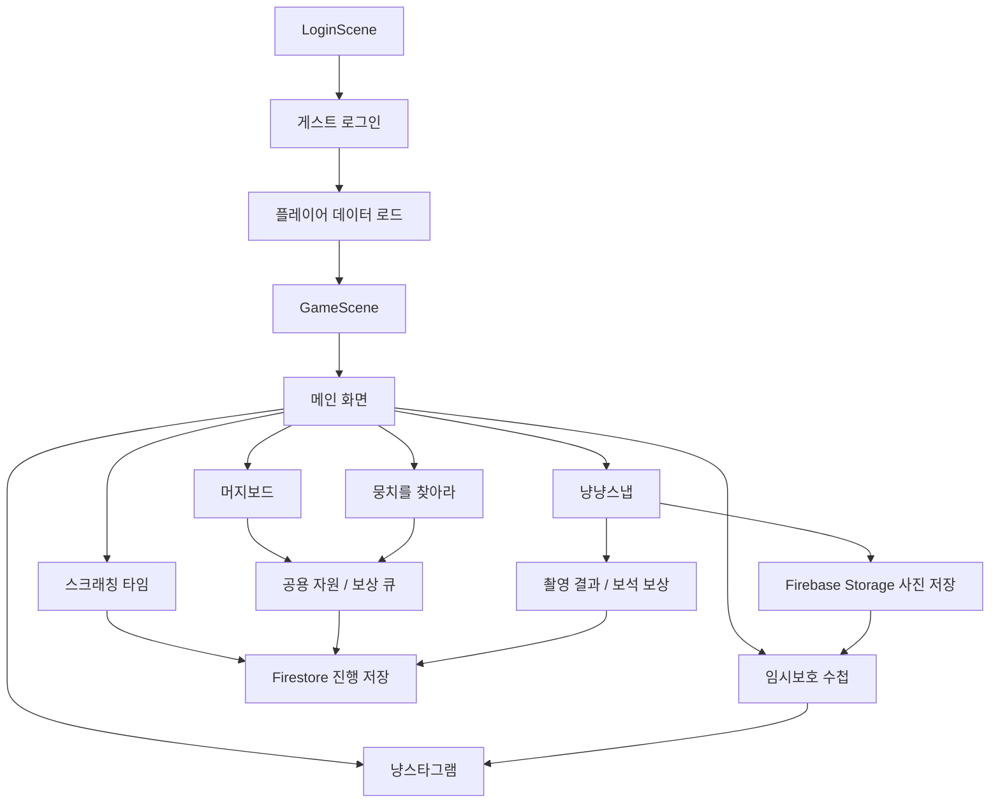
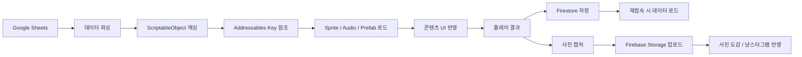

# 냥냥스타 - 기업협약프로젝트 CBT

## Demo -> CBT 업데이트 요약

Demo 버전에서 검증했던 로그인, 메인 화면, 머지보드, 냥냥스냅, 스크래칭 타임 흐름을 기반으로 CBT에서는 실제 플레이 지속성, 사진 저장, 이벤트 콘텐츠, SNS형 콘텐츠, 공용 자원 연동을 확장했다.

| 영역 | CBT 업데이트 내용 |
| --- | --- |
| 빌드 방향 | 단순 데모 검증 버전에서 CBT 플레이 흐름 검증 버전으로 전환했다. |
| 뭉치를 찾아라 | 이벤트 기간, 주차 진행, 타일 탐색, 도구 사용, 일일/주간 미션, 이벤트 상점, 이벤트 코인, 탐색 기회 저장 흐름을 추가했다. |
| 냥냥스냅 | 촬영 결과 저장, 최고 점수 기록, 별점별 보석 보상, 보상형 광고, 좌우 반전 및 결과 연출을 보강했다. |
| 사진 저장/도감 | Firebase Storage 기반 사진 업로드/다운로드/삭제, 임시보호 수첩, 사진 상세 보기, 별점 필터를 추가했다. |
| 냥스타그램 | 홈/프로필, 게시물 등록, 앨범 선택, 게시물 상세, 알림, DM, NPC 프로필 UI 흐름을 추가했다. |
| 머지보드/자원 | 공용 자원 매니저를 도입하고 에너지 소모형 아이템 생성, 보상 큐, 특수 슬롯, 뭉치를 찾아라 미션 연동을 보강했다. |
| 저장 구조 | Firestore 진행 데이터에 더해 Firebase Storage 사진 리소스와 Addressables 리소스 키 기반 로드 구조를 확장했다. |
| 안정화 | 팝업 뒤로가기, 중복 입력 방지, Firestore 초기화 대기, 유저 전환 시 데이터 초기화, 일부 UI 프리팹 연결 이슈를 정리했다. |

## 개요

**냥냥스타**는 고양이와 교감하며 아이템을 수집하고, 촬영 콘텐츠와 미니게임, 이벤트 콘텐츠를 통해 진행 상황을 저장하는 **Android 전용 모바일 캐주얼 게임 CBT 프로젝트**이다.

본 프로젝트는 9:16 세로 화면을 기준으로 제작되었으며, 로그인 이후 플레이어 데이터를 로드하고 메인 화면에서 각 콘텐츠로 진입하는 구조를 가진다.

<!-- 게임 플레이 GIF 추가 위치: Images/Gameplay.gif -->

## 프로젝트 정보

| 항목 | 내용 |
| --- | --- |
| 프로젝트명 | 냥냥스타 |
| README 제목 | 냥냥스타 - 기업협약프로젝트 CBT |
| 개발 기간 | 2026.05.26 ~ 2026.06.23 |
| 프로젝트 형태 | 기업협약 팀 프로젝트 CBT 버전 |
| 팀 구성 | 기획 9명 / 개발 5명 |
| 타겟 플랫폼 | Android |
| 화면 방향 | 세로 고정 |
| 기준 해상도 | 1080 x 1920 |

## 개발 환경

| 분류 | 사용 기술 |
| --- | --- |
| Engine | Unity 2022.3.62f2 |
| Language | C# |
| UI | Unity UI, TextMeshPro |
| Resource | Addressables |
| Backend | Firebase Auth, Firestore, Firebase Storage |
| Data | Google Sheets, ScriptableObject |
| Advertisement | Unity Ads |
| Animation | DOTween |
| Rendering | Universal Render Pipeline |
| Collaboration | GitHub |
| Tool | Rider, Visual Studio, GitHub Desktop, Figma, Notion |

## CBT 구현 범위

| 구분 | 구현 여부 | 설명 |
| --- | --- | --- |
| 로그인 / 게스트 로그인 | 구현 | 게스트 로그인, 세션 초기화, 유저 전환 시 데이터 초기화 흐름을 구성했다. |
| 메인 화면 | 구현 | 콘텐츠 진입 버튼, 공용 자원 UI, 팝업, 화면 전환, 로그아웃 흐름을 배치했다. |
| 공용 자원 시스템 | 구현 | 에너지, 코인, 보석을 Firestore와 동기화하고 콘텐츠별 지급/소모에 사용한다. |
| 머지보드 시스템 | 구현 | 아이템 확인, 선택, 이동, 스왑, 보상 큐, 특수 슬롯, 서버 저장/로드 흐름을 구현했다. |
| 아이템 생성 시스템 | 구현 | 에너지를 소모해 아이템을 생성하고, 보상 큐 또는 보드에 반영한다. |
| 보상 큐 시스템 | 구현 | 보상 아이템을 큐에 저장하고 보드 공간이 생기면 지급하는 구조를 구현했다. |
| 냥냥스냅 촬영 시스템 | 구현 | 스테이지 선택, 장난감/간식 배치, 촬영, 결과 화면, 재시도 흐름을 구현했다. |
| 촬영 채점 시스템 | 구현 | 촬영 결과를 점수, 별점, 보석 보상으로 환산하는 구조를 구현했다. |
| 사진 저장 시스템 | 구현 | 촬영 결과 이미지를 Firebase Storage에 저장하고 Firestore에 메타데이터를 저장한다. |
| 임시보호 수첩 / 사진 도감 | 구현 | 저장 사진 목록, 상세 보기, 삭제, 별점 필터, 새 사진 알림 흐름을 구현했다. |
| 냥스타그램 | 구현 | 저장 사진 기반 게시물 등록, 홈/프로필, 알림, DM, NPC 프로필 UI를 구성했다. |
| 뭉치를 찾아라 | 구현 | 이벤트 기간, 주차, 타일 탐색, 도구 사용, 미션, 상점, 진행 저장/로드를 구현했다. |
| 스크래칭 타임 | 구현 | 스테이지 선택, 터치 기반 진행, 결과 보상, 진행 상태 갱신 흐름을 구현했다. |
| Addressables 리소스 로드 | 구현 | Sprite, Audio, Prefab 로드 구조와 그룹/라벨 키 관리 구조를 구현했다. |
| Firestore 저장 / 로드 | 구현 | 플레이어 기본 정보, 자원, 콘텐츠 진행 상황, 사진 메타데이터 저장/로드를 구현했다. |
| Firebase Storage | 구현 | 유저별 사진 업로드, 다운로드, 삭제 헬퍼와 UI 연동을 구현했다. |
| Unity Ads | 구현 | 냥냥스냅 결과 보상형 광고 버튼과 광고 초기화 흐름을 구현했다. |
| Audio 시스템 | 구현 | BGM, SFX 재생과 주요 버튼 클릭 효과음을 구성했다. |
| UI 팝업 시스템 | 구현 | 팝업 UI를 스택 기반으로 관리하고 주요 팝업의 열기/닫기 흐름을 정리했다. |

## 주요 기능

### 로그인 및 데이터 로드

로그인 화면에서 게스트 로그인을 진행하고, 로그인 이후 플레이어 기본 정보와 콘텐츠 진행 상황을 불러온다.

Firestore 초기화와 유저 세션을 기준으로 데이터를 로드하며, 유저가 바뀌거나 로그아웃하는 경우 기존 세션 데이터를 정리한다.

### 메인 화면

메인 화면은 각 콘텐츠로 진입하는 허브 역할을 한다.

CBT 버전에서는 머지보드, 냥냥스냅, 스크래칭 타임, 뭉치를 찾아라, 임시보호 수첩, 냥스타그램으로 진입할 수 있으며, 일부 부가 버튼은 빈 팝업 또는 준비 중 UI로 구성되어 있다.

### 공용 자원 시스템

공용 자원 시스템은 에너지, 코인, 보석을 하나의 관리 흐름으로 묶는다.

콘텐츠에서 자원을 소모하거나 지급하면 Firestore와 UI 표시가 함께 갱신되며, 머지보드 아이템 생성과 냥냥스냅 보상, 뭉치를 찾아라 보상 흐름에 사용된다.

### 머지보드 시스템

머지보드는 아이템을 확인하고, 선택하고, 빈 슬롯으로 이동하거나 다른 아이템과 스왑할 수 있는 보드 시스템이다.

CBT 버전에서는 에너지를 소모해 아이템을 생성하고, 일반 아이템은 보상 큐를 거쳐 보드로 이동하며, 특수 아이템은 별도 슬롯에 저장된다. 실제 아이템 합성 규칙은 확장 대상으로 남겨두었다.

### 아이템 생성 및 보상 큐

아이템 생성 시스템은 데이터 테이블을 기반으로 아이템을 생성하고, 생성된 아이템을 보상 큐 또는 보드에 반영한다.

보드가 가득 찬 경우 보상 아이템을 큐에 보관하고, 빈 공간이 생기면 다시 지급할 수 있는 구조를 가진다.

### 냥냥스냅 촬영 시스템

냥냥스냅은 스테이지를 선택한 뒤 장난감과 간식을 배치해 고양이를 촬영하는 콘텐츠이다.

플레이어는 촬영 화면에서 고양이의 상태와 타이밍을 확인하고 촬영을 진행한다. 촬영 결과는 점수와 별점으로 환산되며, 결과 화면에서 저장, 재시도, 보상 수령 흐름으로 이어진다.

### 촬영 채점 및 보상 시스템

촬영 채점은 피사체 판정, 타이밍, 구도, 포즈, 배경, 오브젝트 요소를 기준으로 점수를 계산하는 구조이다.

최종 점수는 별점으로 환산되며, 별점에 따라 보석 보상을 지급한다. 결과 화면에서는 별점 연출과 보상형 광고 버튼을 함께 제공한다.

### 사진 저장 및 임시보호 수첩

촬영 결과 사진은 Firebase Storage에 저장하고, 사진 ID, 저장 경로, 별점, 생성 시간 등 메타데이터는 Firestore에 저장한다.

임시보호 수첩에서는 저장된 사진을 다시 불러와 목록으로 보여주고, 별점 필터, 상세 보기, 삭제, 새 사진 알림 흐름을 제공한다.

### 냥스타그램

냥스타그램은 저장된 냥냥스냅 사진을 기반으로 게시물을 등록하고 확인하는 SNS형 콘텐츠이다.

홈/프로필 전환, 앨범에서 게시물 사진 선택, 게시물 상세 보기, 알림, DM 리스트와 대화, NPC 프로필 화면을 팝업 흐름으로 구성했다.

### 뭉치를 찾아라

뭉치를 찾아라는 정해진 이벤트 기간 동안 타일을 탐색해 목표물을 찾는 이벤트 콘텐츠이다.

CBT 버전에서는 이벤트 일정, 현재 주차, 탐색 기회, 이벤트 코인, 일일/주간 미션, 이벤트 상점, 보상 지급, Firestore 진행 저장/로드를 포함한다. 머지보드에서 에너지를 소모하면 관련 미션 진행도와 탐색 기회 보너스도 갱신된다.

### 스크래칭 타임

스크래칭 타임은 터치 입력을 기반으로 진행되는 미니게임 콘텐츠이다.

플레이어가 제한된 조건 안에서 콘텐츠를 진행하고, 결과에 따라 보상과 진행 상태를 갱신하는 구조로 구성했다.

### 리소스 로드

Addressables를 사용하여 Sprite, Audio, Prefab을 로드한다.

Google Sheets에서 관리한 데이터는 ScriptableObject에 캐싱하고, 캐싱된 키 값을 기준으로 Addressables 리소스를 불러오는 구조이다.

### 데이터 저장 및 로드

Firestore를 사용하여 플레이어 기본 정보, 자원, 머지보드 슬롯, 보상 큐, 콘텐츠 진행 상황, 사진 메타데이터를 저장하고 불러온다.

사진 원본 이미지는 Firebase Storage에 저장하며, 게임 흐름은 로그인 이후 데이터 로드, 메인 화면 진입, 콘텐츠 진행, 결과 저장 순서로 구성했다.

## 전체 흐름

## 시스템 구조

```mermaid
flowchart TB
    GM[GameManager]

    GM --> UI[UIManager]
    GM --> AM[AddressableManager]
    GM --> DM[DataManager]
    GM --> AU[AudioManager]
    GM --> FS[FireStoreManager]
    GM --> SM[GameSceneManager]

    UI --> UIRoot[UI Root]
    UI --> SceneUI[Scene UI]
    UI --> PopupUI[Popup UI Stack]

    AM --> Prefab[Prefab Load]
    AM --> Sprite[Sprite Load]
    AM --> Audio[AudioClip Load]

    DM --> Sheet[Google Sheets]
    DM --> SO[ScriptableObject Cache]

    FS --> Player[Player Data]
    FS --> Progress[Content Progress]
    FS --> PhotoMeta[Photo Metadata]

    GM --> RM[PlayerResourceManager]
    RM --> ResourceUI[Resource Display]
    RM --> ResourceStore[ResourcesSO / Firestore]

    UI --> Snap[냥냥스냅]
    UI --> Find[뭉치를 찾아라]
    UI --> Board[머지보드]
    UI --> Gram[냥스타그램]
    UI --> Book[임시보호 수첩]

    Snap --> Storage[Firebase Storage]
    Snap --> Ads[Unity Ads]

    SM --> Login[LoginScene]
    SM --> Game[GameScene]
```

## 데이터 흐름

## 모바일 UI 구성

본 프로젝트는 **1080 x 1920 세로 해상도**를 기준으로 제작했다.

화면 중앙에는 콘텐츠 진행 영역을 배치하고, 주요 버튼은 화면 외곽에 배치하여 모바일 화면에서 콘텐츠 영역이 가려지지 않도록 구성했다.

CBT 버전에서는 메인 화면에서 여러 콘텐츠 팝업과 보드 화면을 오가므로, 주요 팝업의 닫기 버튼, 뒤로가기 버튼, 배경 닫기, 중복 입력 방지 처리를 함께 정리했다.

## 화면 미리보기

| 로그인 화면 | 메인 화면 | 머지보드 |
| --- | --- | --- |
|  |  |  |

| 아이템 생성 | 냥냥스냅 스테이지 | 촬영 화면 |
| --- | --- | --- |
|  |  |  |

| 촬영 결과 | 스크래칭 타임 |
| --- | --- |
|  |  |

## CBT 제외 및 제약 항목

다음 항목은 CBT 버전의 구현 범위에서 제외되었거나 추가 검증이 필요한 항목이다.

- 메인 화면의 메일, 룰렛, 일일 출석, 일반 상점, 친밀도, 스토리북 등 일부 부가 기능은 빈 팝업 또는 준비 중 UI 중심으로 구성했다.
- 머지보드의 실제 아이템 합성 규칙과 장기 밸런싱은 이후 확장 대상으로 남겨두었다.
- Unity Ads, Firebase Auth, Firestore, Firebase Storage 흐름은 Android 빌드 환경과 Firebase 설정이 준비된 상태에서 검증해야 한다.
- 1080 x 1920 외 해상도에 대한 별도 최적화는 제한적으로만 반영했다.
- iOS/tvOS용 Firebase 플러그인 파일은 포함되어 있으나 CBT 타겟 플랫폼은 Android이다.

## 정리

냥냥스타 CBT 버전은 Android 모바일 환경을 기준으로 로그인, 데이터 로드, 메인 화면, 머지보드, 아이템 생성, 냥냥스냅, 사진 저장, 임시보호 수첩, 냥스타그램, 뭉치를 찾아라, 스크래칭 타임 흐름을 검증하기 위해 제작한 팀 프로젝트이다.

Google Sheets, ScriptableObject, Addressables, Firestore, Firebase Storage, Unity Ads를 연계하여 데이터 기반 콘텐츠 흐름을 구성했으며, Unity UI 기반으로 모바일 세로 화면에 맞춘 CBT 플레이 구조를 구현했다.
