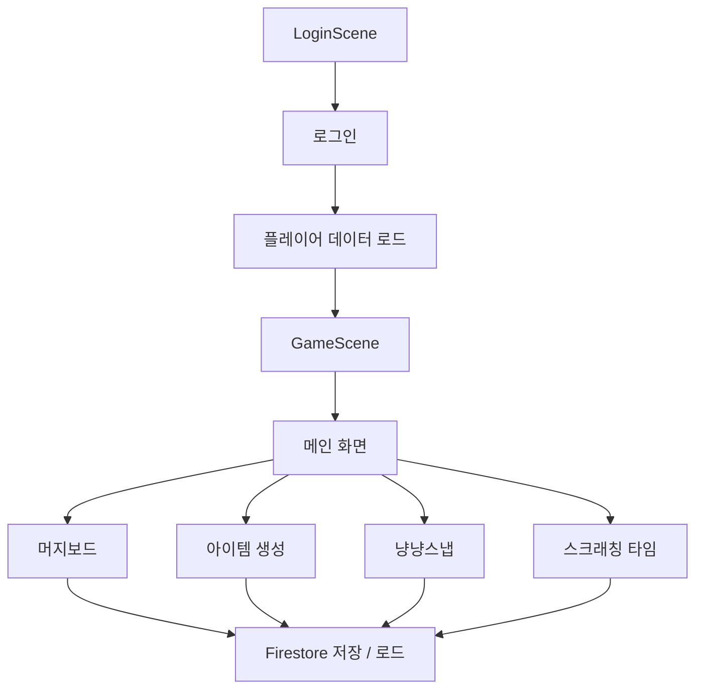
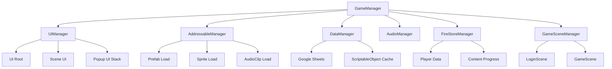
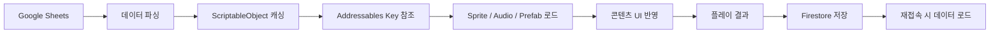

# 냥냥스타 - 기업협약프로젝트

## 개요

**냥냥스타**는 고양이와 교감하며 아이템을 수집하고, 촬영 콘텐츠와 미니게임을 통해 진행 상황을 저장하는 **Android 전용 모바일 캐주얼 게임 데모 프로젝트**이다.

본 프로젝트는 9:16 세로 화면을 기준으로 제작되었으며, 로그인 이후 데이터를 로드하고 메인 화면에서 각 콘텐츠로 진입하는 구조를 가진다.

<!-- 게임 플레이 GIF 추가 위치: Images/Gameplay.gif -->

## 프로젝트 정보

| 항목 | 내용 |
| --- | --- |
| 프로젝트명 | 냥냥스타 |
| README 제목 | 냥냥스타 - 기업협약프로젝트 |
| 개발 기간 | 2026.05.26 ~ 2026.06.08 |
| 프로젝트 형태 | 기업협약 팀 프로젝트 데모 버전 |
| 팀 구성 | 기획 9명 / 개발 5명 |
| 타겟 플랫폼 | Android |
| 화면 방향 | 세로 고정 |
| 기준 해상도 | 1080 x 1920 |

## 개발 환경

| 분류 | 사용 기술 |
| --- | --- |
| Engine | Unity 2022.3.62f2 |
| Language | C# |
| UI | Unity UI, TextMeshPro |
| Resource | Addressables |
| Backend | Firebase, Firestore |
| Data | Google Sheets, ScriptableObject |
| Animation | DOTween |
| Collaboration | GitHub |
| Tool | Rider, Visual Studio, GitHub Desktop, Figma, Notion |

## 데모 구현 범위

| 구분 | 구현 여부 | 설명 |
| --- | --- | --- |
| 로그인 / 게스트 로그인 | 구현 | 로그인 후 게임 데이터 로드 흐름을 구성했다. |
| 메인 화면 | 구현 | 콘텐츠 진입 버튼과 주요 UI를 배치했다. 일부 버튼은 데모용 더미 버튼이다. |
| 머지보드 시스템 | 구현 | 아이템 확인, 선택, 이동, 스왑, 보상 큐 흐름을 구현했다. 머지 기능은 데모 범위에 포함하지 않았다. |
| 아이템 생성 시스템 | 구현 | 데이터 기반 아이템 생성과 보드 반영 흐름을 구성했다. |
| 보상 큐 시스템 | 구현 | 보상 아이템을 큐에 저장하고 보드에 지급하는 흐름을 구현했다. |
| 냥냥스냅 촬영 시스템 | 구현 | 스테이지 선택, 촬영 화면, 촬영 결과 화면 흐름을 구현했다. |
| 촬영 채점 시스템 | 구현 | 촬영 결과를 점수와 별점으로 환산하는 구조를 구현했다. |
| 사진 캡처 | 구현 | 촬영 이미지 캡처까지 구현했다. |
| 사진 저장 시스템 | 미포함 | 데모 버전에는 실제 사진 저장 기능을 포함하지 않았다. |
| 사진 도감 | 미포함 | 데모 버전에는 포함하지 않았다. |
| 냥스타그램 | 미포함 | 데모 버전에는 포함하지 않았다. |
| 스크래칭 타임 | 구현 | 터치 기반 미니게임 콘텐츠를 구현했다. |
| Addressables 리소스 로드 | 구현 | Sprite, Audio, Prefab 로드 구조를 구현했다. |
| Firestore 저장 / 로드 | 구현 | 플레이어 기본 정보와 콘텐츠 진행 상황 저장/로드를 구현했다. |
| Audio 시스템 | 구현 | BGM, SFX 재생 구조를 구현했다. |
| UI 팝업 시스템 | 구현 | 팝업 UI를 스택 구조로 관리한다. |

## 주요 기능

### 로그인 및 데이터 로드

로그인 화면에서 게스트 로그인을 진행하고, 로그인 이후 플레이어 기본 정보와 콘텐츠 진행 상황을 불러온다.

데이터 로드는 로그인 이후 단계적으로 진행되며, 콘텐츠 진행 상황은 Firestore에 저장하고 다시 불러오는 구조이다.

### 메인 화면

메인 화면은 각 콘텐츠로 진입하는 허브 역할을 한다.

데모 버전에서는 메일, 룰렛, 상점 등 일부 버튼은 실제 기능이 연결되지 않은 더미 버튼으로 구성되어 있다.

### 머지보드 시스템

머지보드는 아이템을 확인하고, 선택하고, 빈 슬롯으로 이동하거나 다른 아이템과 스왑할 수 있는 보드 시스템이다.

현재 데모 버전에서는 머지 기능 자체는 포함하지 않았으며, 아이템 상태 확인과 보상 지급 흐름 검증을 중심으로 구현했다.

### 아이템 생성 및 보상 큐

아이템 생성 시스템은 데이터 테이블을 기반으로 아이템을 생성하고, 생성된 아이템을 보상 큐 또는 보드에 반영한다.

보드가 가득 찬 경우 보상 아이템을 큐에 보관하고, 빈 공간이 생기면 다시 지급할 수 있는 구조를 가진다.

### 냥냥스냅 촬영 시스템

냥냥스냅은 스테이지를 선택한 뒤 고양이를 촬영하는 콘텐츠이다.

플레이어는 촬영 화면에서 고양이의 상태와 타이밍을 확인하고 촬영을 진행한다. 촬영 결과는 점수와 별점으로 환산되며, 결과 화면에서 확인할 수 있다.

### 촬영 채점 시스템

촬영 채점은 피사체 판정, 타이밍, 구도, 포즈, 배경, 오브젝트 요소를 기준으로 점수를 계산하는 구조이다.

최종 점수는 별점으로 환산되며, 결과 화면에서 촬영 결과와 함께 출력된다.

### 스크래칭 타임

스크래칭 타임은 터치 입력을 기반으로 진행되는 미니게임 콘텐츠이다.

플레이어가 제한된 조건 안에서 콘텐츠를 진행하고, 결과에 따라 진행 상태를 갱신하는 구조로 구성했다.

### 리소스 로드

Addressables를 사용하여 Sprite, Audio, Prefab을 로드한다.

Google Sheets에서 관리한 데이터는 ScriptableObject에 캐싱하고, 캐싱된 키 값을 기준으로 Addressables 리소스를 불러오는 구조이다.

### 데이터 저장 및 로드

Firestore를 사용하여 플레이어 기본 정보와 콘텐츠 진행 상황을 저장하고 불러온다.

게임 흐름은 로그인 이후 데이터 로드, 메인 화면 진입, 콘텐츠 진행, 결과 저장 순서로 구성했다.

## 전체 흐름

## 시스템 구조

## 데이터 흐름

## 모바일 UI 구성

본 프로젝트는 **1080 x 1920 세로 해상도**를 기준으로 제작했다.

화면 중앙에는 콘텐츠 진행 영역을 배치하고, 주요 버튼은 화면 외곽에 배치하여 모바일 화면에서 콘텐츠 영역이 가려지지 않도록 구성했다.

데모 버전에서는 1080 x 1920 외의 별도 해상도 대응 최적화는 포함하지 않았다.

## 화면 미리보기

| 로그인 화면 | 메인 화면 | 머지보드 |
| --- | --- | --- |
|  |  |  |

| 아이템 생성 | 냥냥스냅 스테이지 | 촬영 화면 |
| --- | --- | --- |
|  |  |  |

| 촬영 결과 | 스크래칭 타임 |
| --- | --- |
|  |  |

## 데모 제외 항목

다음 기능은 데모 버전의 구현 범위에 포함하지 않았다.

- 머지보드의 실제 머지 기능.
- 촬영 결과 이미지의 실제 저장 기능.
- 사진 도감 기능.
- 냥스타그램 기능.
- 메인 화면의 일부 부가 기능 버튼.
- 1080 x 1920 외 해상도 대응 최적화.

## 정리

냥냥스타 데모 버전은 Android 모바일 환경을 기준으로 로그인, 데이터 로드, 메인 화면, 머지보드, 아이템 생성, 냥냥스냅, 스크래칭 타임 흐름을 검증하기 위해 제작한 팀 프로젝트이다.

Google Sheets, ScriptableObject, Addressables, Firestore를 연계하여 데이터 기반 콘텐츠 흐름을 구성했으며, Unity UI 기반으로 모바일 세로 화면에 맞춘 데모 플레이 구조를 구현했다.
